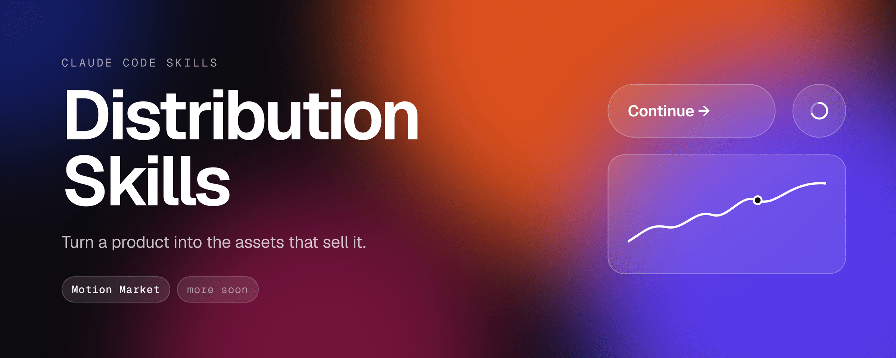

<p align="center"></p>

# Distribution Skills

Skills for Claude Code that turn a product into the assets that sell it.

| Skill | What it makes |
|---|---|
| [Motion Market](plugins/motion-market/skills/motion-market/SKILL.md) | A UI motion video of your app. One shape morphs through your real UI states, a cursor drives each change, and it's cut to music. You get a seamless loop at 60 fps: square, vertical or landscape, plus a social MP4, a README GIF and a poster. |

## Install

In Claude Code:

```
/plugin marketplace add lusknchars/distribution-skills
/plugin install motion-market@distribution-skills
```

Or copy `plugins/motion-market/skills/motion-market` into `~/.claude/skills/`.

## Your first video

Open Claude Code in your app's repo and ask:

> Make a motion video for our app.

Other prompts that work:

> Make a vertical motion video of our checkout flow for Instagram Reels.
>
> Make a 4-bar landscape loop showing sign-up → onboarding → dashboard, dark theme, you pick the song.

Claude then:

1. **Checks your machine** and tells you exactly what to install if anything is missing.
2. **Asks 3 things:** which screens to show, the palette (it reads your app's colors, font and copy) and the song. Say "you choose" to take the defaults.
3. **Shows a beat-by-beat plan** before writing any code. Each row is one beat: what happens, and where the camera goes.
4. **Builds it, then checks one still per beat**, and fixes anything cramped, off-beat or out of frame.
5. **Renders and exports:**

| File | Use it for |
|---|---|
| `out/video.mp4` | The master: 60 fps with motion blur, a seamless loop |
| `out/share.mp4` | X, LinkedIn, Instagram, Slack (1080 on the short side) |
| `out/preview.gif` | READMEs, docs, Notion |
| `out/poster.png` | Thumbnails |

A 14-second video renders in about a minute on a recent laptop.

## Formats

| Format | Size | For |
|---|---|---|
| `square` (default) | 1440×1440 | Feeds, landing pages, Dribbble |
| `vertical` | 1080×1920 | Reels, TikTok, Shorts, Stories |
| `landscape` | 1920×1080 | YouTube, websites, decks |

The camera re-frames the same scene for each format, so you can ask for "the vertical version too" without rebuilding anything.

## Examples in the skill

- **`shape-morph`**: light and square, 7 bars, 11 states: button → loader → check → dynamic island → music player → volume slider → toggle → tabs → chart → ⌘K → toast.
- **`upload-share`**: dark and vertical, 4 bars: upload → drag a file onto a dropzone → progress → share toggle → copy link → toast.

Start from one with `sh scripts/new-project.sh my-video upload-share`, run from the skill folder.

## Requirements

- Node 18+
- Python 3 with numpy
- ffmpeg with libx264

On Windows, use WSL. The skill's `doctor.sh` checks all of this and prints the install command for your OS. Playwright's Chromium is installed for you.

## Music and images

- The song finder searches [Mixkit](https://mixkit.co/free-stock-music/), where tracks are free for commercial use under the Mixkit license. You can also bring your own file.
- If you add photos, use ones you have rights to. The [Unsplash License](https://unsplash.com/license) works; Unsplash+ images don't.
- Credit the song and any photos where your platform expects it.

## Troubleshooting

| Problem | Fix |
|---|---|
| Something is missing on your machine | Run `sh scripts/doctor.sh` from the skill folder |
| "BOUNDS: … outside the frame" | The review found a moment where the cursor or shape leaves the frame. Claude fixes these before rendering; ask it to "fix the bounds". |
| "STUTTER" from the loop check | Something jumps at the loop point. Ask Claude to "fix the loop seam". |
| Text looks small in the vertical version | Ask for "bigger type in the vertical format". Tall frames are width-bound. |

## License

[MIT](LICENSE)
